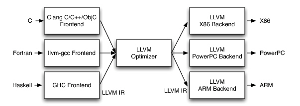
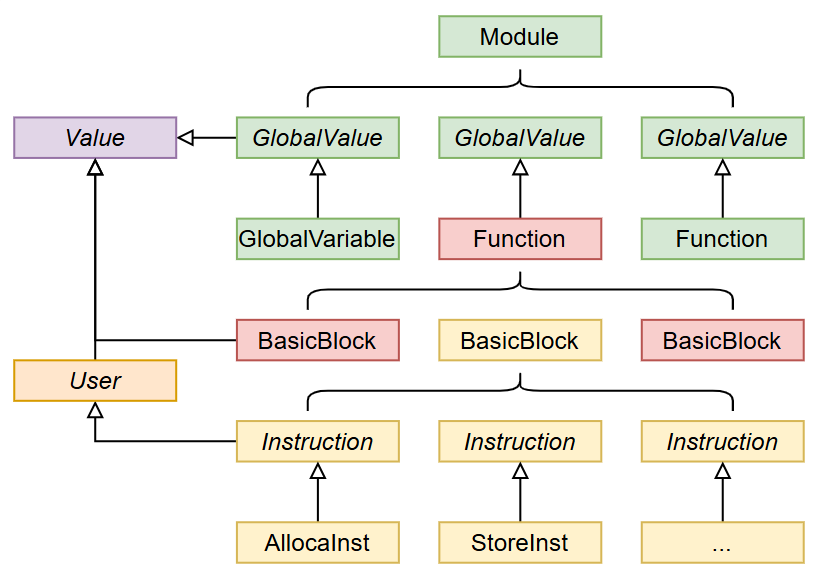

# <div align="center">LLVM IR</div>

## 一、总览



* 将LLVM-IR视为一种特殊的编程语言，介于高级语言与低级语言之间

* LLVM是静态单赋值语言(SSA)

* 链接自己生成的llvm IR和课程组的lib.ll(提供输入输出函数)

  ```sh
  llvm-link lib.ll main.ll -o out.ll
  lli out.ll
  ```

* 一个例程

  ```cpp
  ; first.ll
  declare void @putint(i32)
  
  define i32 @main() {
    call void @putint(i32 1)
    call void @putint(i32 2)
    %result = add i32 1, 2
    call void @putint(i32 %result)
  
    ret i32 0
  }
  ```

  * ;表示注释

  * declare：头函数声明

  * define：函数定义

  * call：函数调用

  * %result表示了一个寄存器，保存运算结果

    > LLVM IR中这些寄存器并不对应任何指令集中的实际寄存器，是“虚拟寄存器”，可以任意分配

  * 在每一次使用到某一值时都需要说明其类型：`i32`

* LLVM IR构建单元



​	LLVM IR中一个`.ll`文件对应一个`Module`，一个`Module`由若干`GlobalValue`组成，一个`GlobalValue`可以是全局变量`GlobalVariable`，也可以是函数`Function`，一个函数由若干基本块`BasicBlock`组成，基本块内部由若干指令`Instruction`组成。

​	LLVM中所有类都直接或间接继承自`Value`，通过继承关系就可以得到LLVM IR中的类型系统，为了表达`Value`之间的引用关系，LLVM IR中还有一种特殊的`Value`叫做`User`，将其他`Value`作为参数。例如`Instruction`继承自`User`，因此它可以将其他`Value`作为参数。

## 二、类型

​	LLVM IR是强类型的，**每一个数值或变量在使用的时候都需要先指明其类型**。

### 1. 基本类型

​	LLVM IR中基本类型包括整形、浮点型和空类型(`void`)

#### 1.1 整型

​	LLVM只关注整形的长度，不关心符号(符号的区别在LLVM中由指令表明)。整型的长度，LLVM并不明确设定为32和64,而是**可以选择$1$ ~ $2^{23}-1$位中任意数值作为整形所占bit数**：`i1`,`i2`,`i8`,`i32`,`i64`。

​	`i1`在LLVM IR中明确表示`bool`类型，常量值为`true`或`false`，而非0或1。

#### 1.2 浮点型

​	浮点类型包括`float`和`double`,并非所有小数都能用浮点数表示(计算机01表示存在的误差)，因此有许多浮点数常量不能直接被使用，例如2.0可以由浮点数表示，因此可以作为常量；而0.2不能由浮点数表示，不能作为常量。**更好的方式是使用16进制表示浮点数。**

### 2. 聚合类型

#### 2.1 数组

* LLVM IR中用`[N x T]`的形式表示数组，`N`表示数组的长度，`T`表示元素的类型。

* 数组常量值用`[T V, T V, ...]`表示：类型 值

  ```cpp
  ; array.ll
  declare void @putint(i32)
  
  ; 定义全局变量 @arr，这里用到了数组常量进行初始化
  @arr = global [3 x i32] [i32 1, i32 2, i32 3]
  ```

#### 2.2 结构体

​	结构体在使用前需要先定义，定义方式和C语言类似，必须在函数体外定义。

``` cpp
%MyStruct = type {
    i32,
    float,
    [3 x i32]
}
```

​	定义结构体常量：`{T V, T V, ...}`

```cpp
; struct.ll
declare void @putint(i32)
declare void @putfloat(float)

%MyStruct = type {
    i32,
    float,
    [3 x i32]
}

@mystruct = global %MyStruct { i32 10, float 2.0, [3 x i32] [i32 3, i32 2, i32 1]}
```

### 2.3 指针

​	所有类型都有其对应的指针，例如`i32*`。

​	指针与整形互相转化：

* `ptrtoint .. to`：指针转换为整型

  ```cpp
  %addr_int = ptrtoint i32* %some_addr to i64
  ```

* `inttoptr .. to`

## 三、变量

​	按存储位置，变量分为三类，分别为栈上变量、堆上变量和静态存储区的变量。堆上变量由操作系统（或者说程序员）分配，在编译中并不考虑，所以实际上LLVM IR中只有另外两种变量。

### 3.1 全局量

​	全局量即为静态存储区的变量，定义在函数体以外的全局变量。**全局变量可以使用`global`或`constant`定义**，全局量以`@`开头，型为`@xxx`，其中使用`constant`定义的全局量只读而不可写，这些变量都需要为其**设置初始值，不设定默认为0**。

> 全局量型为@xxx,此标签与函数体中使用的“虚拟寄存器”不同，**实际上应当看作汇编中的标签，或者说其本质是一个地址，或者说是一个指向所定义全局量的指针。**因此`%t = add i32 @a, 1`这样的表述是错误的，`@a`的类型应当为`i32*`

### 3.2 局部量

​	除了全局量只剩下栈上变量了，或者说是局部变量。**LLVM中使用一条特殊的指令`alloca`表示函数中的栈上空间的申请操作。**函数返回时，会自动释放栈上空间。

> 局部变量没有真正的constant,对于全局量，可以将变量和常量划分到不同的地址区域中，使得变量所在地址空间可读写，常量地址空间只可读。

​	`alloca`指令的具体形式为`%xxx = alloca T`，表示分配了一块用于存储T类型的栈上空间。其地址存储在虚拟寄存器`%xxx`中，`%xxx`的类型为`T*`而非T。

> `alloca`与全局变量的定义有不同之处，`alloca`指令不会带有初始值，如果想要设定初始值只能通过在`alloca`命令之后加一条`store`指令设定其值。

>  需要注意`alloca`只应在函数开始时使用，因为`alloca`本质上是向下移动栈指针，如果`alloca`不在最开始使用，则可能会出现在循环中，不停分配栈空间，导致栈溢出。

​	**想要对内存进行存取操作，需要两条操作`store`和`load`**，LLVM IR中操作的是寄存器而非内存。

* `store`：将寄存器中的值存储到目的内存空间中

  ```cpp
  store T %val, P %ptr
  ```

  * %val为存储值的寄存器，T为其类型
  * %ptr为存储地址的寄存器，P为其类型

* `load`：从内存空间中取值到寄存器

  ```cpp
  %val = load T, P %ptr
  ```

* ```cpp
  %var = alloca i32
  store i32 123, i32* %var
  ```

### 3.3 getelementptr

​	形式为：
```cpp
%ptr = getelementptr T, T* %baseptr, V %idx1, V idx2, ...
```

​	其中如果需要获取成员变量的地址可以不断在后面加偏移量。

## 四、运算

> 运算指令的两输入必须是相同的类型
>
> %xxx = <op> T %yyy, %zzz

### 4.1 算数运算

​	整数：

| c    | LLVM IR                |
| ---- | ---------------------- |
| +    | add                    |
| -    | sub                    |
| *    | mul                    |
| /    | sdiv / udiv (有无符号) |
| %    | srem / urem            |
| \|   | or                     |
| &    | and                    |
| <<   | shl                    |
| >>   | ashr                   |

> 对于整数：除了除法之外的其他指令，有无符号并无区别，在使用除法的时候却需要指定有无符号，取模操作实际上是除法时求余数，因此也需要指定有无符号，另外C中>>为算数右移，因此llvm ir为ashr

​	浮点数：

| c    | LLVM IR |
| ---- | ------- |
| +    | fadd    |
| -    | fsub    |
| *    | fmul    |
| /    | fdiv    |
| %    | frem    |

> 浮点数都是有符号的，对于除法来说不再有sdiv和udiv的区别

### 4.2 逻辑运算

​	对于整数和浮点数，分别用`icmp`和`fcmp`指令进行计算，基本形式为：

```cpp
%xxx = (icmp | fcmp) <cond> T %yyy, %zzz
```

​	运算结果为`i1`类型，即为`bool`类型

| c    | llvm ir |
| ---- | ------- |
| ==   | eq      |
| !=   | ne      |
| >    | gt      |
| >=   | ge      |
| <    | lt      |
| <=   | le      |

### 4.3 类型转换

​	**对于整数来说，整数类型之间的转换就是扩充或截断一些bit位。**

* `zext(Zero Extend)`：高位补0

  ```cpp
  %xxx = zext T %yyy to Y // Y是转换到的类型
  ```

* `sext(Sign Extend)`：符号扩展

* `trunc`：用于对高位进行截断

  对浮点数来说也有类似指令

* `fpext`
* `fptrunc`
* `fptoui`
* `fptosi`
* `uitofp`
* `sitofp`

## 五、函数调用

​	函数调用的使用方式为：

```cpp
%xxx = call T @fff(T1, %p1, T2, %p2);
```

​	当函数的返回值为void类型时不需要前面的赋值。

​	llvm ir函数定义中，参数实际上被表示成虚拟寄存器而不是保存在栈中

```cpp
define void @func2(i32* %arr) {
    //
}
```

> 为保持一致性，可以在函数体中使用alloca指令为参数分配栈上空间，再使用store指令将参数寄存器中的值保存在栈上。

## 六、流程控制

​	LLVM IR或更底层的语言中，流程控制仅仅表现为跳转指令，LLVM IR中的跳转指令为`br`。

​	`br`有两种使用形式，一种是条件跳转，接受一个bool类型的值，label表示跳转到的标签：

```cpp
br i1 %cond, label %iftrue, label %iffalse
```

​	另一种形式为无条件跳转：

```	cpp
br label %target
```

​	标签就是一个名称加冒号：`labelname:`，在汇编中实际指代紧跟冒号后的第一条指令的地址。

​	**LLVM中规定两个标签之间的最后一条语句必须为`br`或`ret`，标签之间不能没有语句。**

### 6.1 if

```cpp
; ifelse.ll

define void @dosomething() {
  ret void
}

define void @if(i1 %cond) {
  br i1 %cond, label %true, label %fi

true:
  call void @dosomething() ; do something if cond is true
  br label %fi

fi:
  ret void
}

define void @ifelse(i1 %cond) {
  br i1 %cond, label %true, label %false

true:
  call void @dosomething() ; do something if cond is true
  br label %fi

false:
  call void @dosomething() ; do something if cond is false
  br label %fi

fi:
  ret void
}
```

### 6.2 while/for

```cpp
; loop.ll

define void @dosomething() {
  ret void
}

define void @while(i1 %cond) {
  br label %while

while:
  br i1 %cond, label %do, label %done

do:
  call void @dosomething() ; do something while cond is true
  br label %while

done:
  ret void
}

define void @dowhile(i1 %cond) {
  br label %do

do:
  call void @dosomething() ; do something until cond is false
  br label %while

while:
  br i1 %cond, label %do, label %done

done:
  ret void
}

define void @for(i1 %cond) {
  call void @dosomething() ; initial stmt
  br label %for

for:
  br i1 %cond, label %do, label %done

do:
  call void @dosomething() ; do something while cond is true
  br label %update

update:
  call void @dosomething() ; update stmt
  br label %for

done:
  ret void
}
```

### 6.3 短路求值

​	对跳转语句中的条件值实现短路求值：可以使用`icmp/fcmp`和`and/or`来实现所有的bool运算，但是并不满足编程语言中的一个基本设计，即短路求值。

* `$ |`：按位逻辑运算，不满足短路求值，两边都要算一次
* `$$ ||`：逻辑运算，满足短路求值

​	假设有一系列基本块，`cond1`，`cond2`，...`condn`，这些基本块分别表示条件表达式中被`||`和`&&`分隔开的不同表达式。对于每一个表达式的基本块，要分别设定为真和为假时的跳转的目标。

​	**即对于基本块B,要设定$iftrue_{B}和iffalse_{B}$**。
