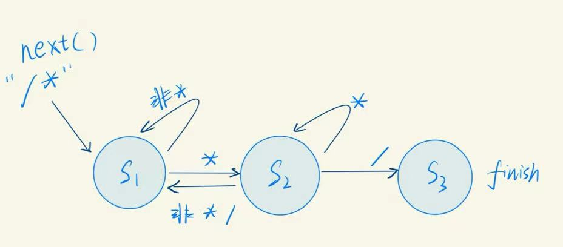

# <div align="cneter">编译器设计文档</div>

<div align = "right">——22373362杜启嵘</div>

## 一、参考编译器介绍

## 二、编译器总体设计

> 使用cpp进行编译器实现

## 三、词法分析设计

### 3.1 初始设计

​	词法分析部分的主要任务是将读入的文件(字符串)进行一遍“字符串解析”，将读入的字符串中的单词按照种类识别出来。

| 单词名称        | 类别码     | 单词名称 | 类别码    | 单词名称 | 类别码 | 单词名称 | 类别码  |
| :-------------- | :--------- | :------- | :-------- | :------- | :----- | :------- | :------ |
| **Ident**       | IDENFR     | else     | ELSETK    | void     | VOIDTK | ;        | SEMICN  |
| **IntConst**    | INTCON     | !        | NOT       | *        | MULT   | ,        | COMMA   |
| **StringConst** | STRCON     | &&       | AND       | /        | DIV    | (        | LPARENT |
| **CharConst**   | CHRCON     | \|\|     | OR        | %        | MOD    | )        | RPARENT |
| main            | MAINTK     | for      | FORTK     | <        | LSS    | [        | LBRACK  |
| const           | CONSTTK    | getint   | GETINTTK  | <=       | LEQ    | ]        | RBRACK  |
| int             | INTTK      | getchar  | GETCHARTK | >        | GRE    | {        | LBRACE  |
| char            | CHARTK     | printf   | PRINTFTK  | >=       | GEQ    | }        | RBRACE  |
| break           | BREAKTK    | return   | RETURNTK  | ==       | EQL    |          |         |
| continue        | CONTINUETK | +        | PLUS      | !=       | NEQ    |          |         |
| if              | IFTK       | -        | MINU      | =        | ASSIGN |          |         |

​	对于表格中给出的token种类，笔者使用一个枚举类型``TokenType``进行记录，该枚举类型内嵌在``Token``类中，``Token``类中有三个属性变量：token的字符串表示(``string``)，token的种类(``TokenType``)，token所属的行(``line_number``)，并定义其to_string方法用于输出。

```cpp
public:
enum TokenType {
    IDENFR, INTCON, STRCON, CHRCON, MAINTK, CONSTTK, INTTK, CHARTK, BREAKTK, CONTINUETK,
    IFTK, ELSETK, NOT, AND, OR, FORTK, GETINTTK, GETCHARTK, PRINTFTK, RETURNTK, PLUS, MINU,
    VOIDTK, MULT, DIV, MOD, LSS, LEQ, GRE, GEQ, EQL, NEQ, ASSIGN, SEMICN, COMMA, 
    LPARENT, RPARENT, LBRACK, RBRACK, LBRACE, RBRACE
};
```

​	词法分析由``Lexer``类完成，其**属性**定义为：

* source(string)：读入的程序字符串
* line_number(int)：当前分析到的行号
* pos(int)：当前分析的字符串索引位置
* errors(``vector<Error>``)：记录错误的数组(在词法分析阶段只有a类错误)
* tokens(``vector<TOken>``)：解析字符串得到的Token数组
* reverse_words(``unordered_map<std::string,Token::TokenType>``)：``SysY``保留字表

```cpp
// lexer.h    
private:
        std::string source;
        int pos;
        Token::TokenType token_type;
        int line_number;
        std::unordered_map <std::string, Token::TokenType> reserve_words;
        std::vector <Error> errors;  // 保存a类错误
        std::vector <Token> tokens;
```

``Lexer``类中的**方法**定义为：

* `initialize_reverse_word_map()`：建立保留字表，用于后续查找
* 构造方法/析构方法
* ``next()``：按照读入的字符`ch=source[pos]`,从字符串中解析token，存入其自身属性tokens
  * ``intcon()``：解析`INTCON`种类token的私有方法
  * `idenfr()`：解析`IDENFR`种类token的私有方法
  * `skip_single_line_comment()`：处理单行注释的私有方法
  * ``skip_multi_line_comment()``：处理多行注释的私有方法(状态机设计)
  * ``chrcon()``：解析`CHRCON`种类token的私有方法(尤其要注意转义字符的处理`\`)
* `run()`：按格式输出`tokens/errors`数组到文件中

```cpp
    public:
        Lexer(std::string source);
        ~Lexer();
        void next();
        void run();
    
    private:
            void intcon();
            void idenfr();
            void strcon();
            void chrcon();
            void skip_single_line_comment();
            void skip_multi_line_comment();
            void initialize_reverse_word_map();
```

​	**处理多行注释的状态机设计**：借鉴了课程组提供的词法分析`ppt`中的思路，但由于笔者的设计中只有连续读到`/,*`符号才会进入多行注释处理程序，因此只需要一个三状态状态机。

```cpp
// multi_line_comment_fsm.h
enum State {
    S1,S2,S3
};
```

​	状态转移图如下图：

<!DOCTYPE html>
<html lang="en">
<head>
    <meta charset="UTF-8">
    <meta name="viewport" content="width=device-width, initial-scale=1.0">
    <title>Image Example</title>
    <style>
        .centered-image {
            display: block;
            margin-left: auto;
            margin-right: auto;
            height: 100px;
        }
    </style>
</head>
<body>
    
</body>
</html>
​	**词法分析阶段的错误处理：**在词法分析阶段只会有a类错误：将`&& / ||`记为`& / |`，为了可扩展性考虑，笔者建立了`Error`类来管理错误，其属性为：行号(`line_number`)，错误类型(error_type)，并定义相应的to_string方法用于输出Error类实例对象的字符串格式。

### 3.2 编码后修改

​	在完成语法分析部分时，词法分析部分读到错误的token时，不仅要报告错误，**还要返回正确的token类型**，需要对原设计进行修改。

## 四、语法分析部分设计

​	语法分析部分的任务主要为在读取Token流的同时建立抽象语法树，我的设计主要分为两部分：一是抽象语法树节点的设计，二是语法成分分析程序的设计(包括处理多产生式、处理左递归产生式)。

### 4.1 抽象语法树(AST)

> 该部分主要在ast.h/ast.cpp中实现

​	抽象语法树的根节点为编译程序单元(CompUnit)，各树节点为非终结符，叶子节点为终结符语法成分。对于各个节点，我们可以建立一个基类`Node`，其中包含各种树节点的一个公共属性所属行(`line_number`)，一个公共打印方法(`print`)。

```cpp
struct Node {
    int line_number;

    Node() = default;
    Node(int line_number) : line_number(line_number) {}
    virtual void print(std::ostream &os) = 0;
};
```

​	而后各种语法成分继承基类，重载`print`方法，并对应各自的构造函数，例如：

```cpp
struct CompUnit : public Node {
    std::vector<std::unique_ptr<FuncDef>> func_defs;
    std::vector<std::unique_ptr<Decl>> decls;
    std::unique_ptr<MainFunc> main_func;

    CompUnit(std::vector<std::unique_ptr<FuncDef>> func_defs, std::vector<std::unique_ptr<Decl>> decls, std::unique_ptr<MainFunc> main_func);
    void print(std::ostream &os) override;
};
```

​	同时，对于一种非终结符所管理的其他语法成分，我们使用C++11标准中提供的特性unique_ptr智能指针，该指针保证一个指针只能指向内存中一个内存实体，或者说所有权只能归一个指针所属，通过对这块对象的所有权传递(`std::move()`)来保证在函数传参等过程中不会发生参数的复制，减少内存开销。

​	对于多产生式的推导规则，我采用了两种方法，对于推导规则中不包含递归式的，例如`Stmt`：

```c++
using Stmt = std::variant<AssignStmt, ExpStmt, BlockStmt, IfStmt, ForStmt, BreakStmt, 
                        ContinueStmt, ReturnStmt, GetIntStmt, GetCharStmt, PrintfStmt>;
```

​	对于这种情况，我们可以使用C++17标准中提供的`std::variant`来实现，该类型保证了实际存储类型中只能是声明中的任一种类型，并通过`get_if<T>`方法来返回指定T类型的指针(如果存储的是T类型，则返回T*类型，否则返回nullptr)，或者通过`std::visit()`方法访问其中的内容(`visit`内存需要传入一个匿名函数)。

​	对于推导规则中包含递归式的，例如算数表达式的推导，我采用结构体来实现，并在语法分析阶段递归创建结构体。

```cpp
struct MulExp : public Node {
    //  MulExp → UnaryExp | MulExp ('*' | '/' | '%') UnaryExp 
    std::unique_ptr<MulExp> mulexp; //!需要使用指针来避免无限递归
    std::unique_ptr<Token> op;
    std::unique_ptr<UnaryExp> unaryexp;

    void print(std::ostream &os) override;
    MulExp(std::unique_ptr<MulExp> mulexp, std::unique_ptr<Token> op, std::unique_ptr<UnaryExp> unaryexp);
    MulExp(std::unique_ptr<UnaryExp> unaryexp);
};
```

### 4.2 语法分析(Parser)

​	对于语法分析程序，主要需要处理的点为多产生式的处理和左递归产生式的处理。

#### 4.2.1 多产生式的处理

​	对于一些多产生式规则，各个产生式的FIRST集交集为空，这样只需要当前读到的Token就可以知道属于哪一种产生式，而无需进行预读，例如`InitVal`,`ConstInitVal`，对于各个产生式的FIRST交集不为空的情况，可以采取预读的策略，在判断结束后再回退读到的token，我在parser中实现了该功能。

```cpp
        std::deque<Token> buffer; // 正常的token缓存区
        std::deque<Token> backbuf; // 保存预读的token
        std::deque<Token> recoverybuf; // 保存stmt处理中读LVal的token 这部分实际上是可能解析错误的, 见parser.cpp中的注释
        bool is_recovering = false; // 是否正在恢复
```

​	其中buffer为正常读入的token缓冲区，backbuf中保存预读的token，而后再从backbuf中读取(这一规则在后续详细介绍)。

​	而对于最复杂的一种，例如`Stmt`中多产生式的处理，

```cpp
语句 Stmt → LVal '=' Exp ';' // 每种类型的语句都要覆盖
| [Exp] ';' //有无Exp两种情况
| Block
| 'if' '(' Cond ')' Stmt [ 'else' Stmt ] // 1.有else 2.无else
| 'for' '(' [ForStmt] ';' [Cond] ';' [ForStmt] ')' Stmt // 1. 无缺省，1种情况 2.
ForStmt与Cond中缺省一个，3种情况 3. ForStmt与Cond中缺省两个，3种情况 4. ForStmt与Cond全部
缺省，1种情况
| 'break' ';' | 'continue' ';'
| 'return' [Exp] ';' // 1.有Exp 2.无Exp
| LVal '=' 'getint''('')'';'
| LVal '=' 'getchar''('')'';'
| 'printf''('StringConst {','Exp}')'';' // 1.有Exp 2.无Exp
```

​	在首先利用FIRST集不相交的部分判断一些规则之后，以下几条规则中FIRST集有相交

* LVal '=' Exp ';'
*  [Exp] ';'（**其中规则二排除了FIRST不相交的情况后起始成分最终推导也为LVal**）
* LVal '=' 'getint''('')'';'
* LVal '=' 'getchar''('')'';'

​	可以按照先解析一个LVal成分(一种步伐比较大的预读)，而后继续向下，这样可以判断出他们的分别，但是问题在于，这种解析方法对于规则2中的Exp并不适用(即使可以进行parse,但并不满足语法推导，得到的LVal不是合法的语法成分)，也就是说我们需要设计一种“回退”机制，可以回退解析LVal过程中读入的Token，对于Exp这种情况使用Exp的解析程序重新解析，得到符合语法推导的语法成分，本文设计了一种**恢复模式**，在后文中介绍。

​	对于`Stmt`的解析逻辑如下：

```cpp
std::unique_ptr<Stmt> Parser::parse_stmt() {
    if (get_curtoken().get_type() == Token::LBRACE) { // Block
        auto block = parse_block();
        return std::make_unique<Stmt>(std::in_place_type<BlockStmt>,BlockStmt(std::move(block)));
    } else if (get_curtoken().get_type() == Token::IFTK) { //IF
        auto if_stmt = parse_ifstmt();
        return std::make_unique<Stmt>(std::in_place_type<IfStmt>,std::move(*if_stmt));
    } else if (get_curtoken().get_type() == Token::FORTK) { //FOR
        auto for_stmt = parse_forstmt();
        return std::make_unique<Stmt>(std::in_place_type<ForStmt>,std::move(*for_stmt));
    } else if (get_curtoken().get_type() == Token::BREAKTK) { //BREAK
        auto break_stmt = parse_breakstmt();
        return std::make_unique<Stmt>(std::in_place_type<BreakStmt>,std::move(*break_stmt));
    } else if (get_curtoken().get_type() == Token::CONTINUETK) { // CONTINUE
        auto continue_stmt = parse_continuestmt();
        return std::make_unique<Stmt>(std::in_place_type<ContinueStmt>,std::move(*continue_stmt));
    } else if (get_curtoken().get_type() == Token::RETURNTK) { // RETURN 
        auto return_stmt = parse_returnstmt();
        return std::make_unique<Stmt>(std::in_place_type<ReturnStmt>,std::move(*return_stmt));
    } else if (get_curtoken().get_type() == Token::PRINTFTK) { // PRINTF
        auto printf_stmt = parse_printfstmt();
        return std::make_unique<Stmt>(std::in_place_type<PrintfStmt>,std::move(*printf_stmt));
    } else if (get_curtoken().get_type() == Token::LPARENT ||
                get_curtoken().get_type() == Token::PLUS ||
                get_curtoken().get_type() == Token::MINU || 
                get_curtoken().get_type() == Token::NOT ||
                get_curtoken().get_type() == Token::INTCON ||
                get_curtoken().get_type() == Token::CHRCON) { // EXP 注意这里不能有IDENFR
        auto exp = parse_exp();
        if (get_curtoken().get_type() == Token::SEMICN) {
            next_token();
        } else { // i error
            unget_token();
            report_error(get_curtoken().get_line_number(), 'i');
            next_token();
        }
        return std::make_unique<Stmt>(std::in_place_type<ExpStmt>,ExpStmt(std::move(exp)));
    } else if (get_curtoken().get_type() == Token::SEMICN) { // [EXP];(无exp)
        next_token();
        return std::make_unique<Stmt>(std::in_place_type<ExpStmt>,ExpStmt(nullptr));
    } else { // IDENTFR : may be rule 1,2,8,9
        Token t1 = get_curtoken();
        next_token();
        Token t2 = get_curtoken();
        unget_token();
        if (t1.get_type() == Token::IDENFR && t2.get_type() == Token::LPARENT) { // rule2 ident()
            auto exp = parse_exp();
            if (get_curtoken().get_type() == Token::SEMICN) {
                next_token(); // 读到LVal的起始token
            } else { // i error
                unget_token();
                report_error(get_curtoken().get_line_number(), 'i');
                next_token();
            }
            return std::make_unique<Stmt>(std::in_place_type<ExpStmt>,ExpStmt(std::move(exp)));
        } else { // 1,2,9,10
            // 2余下的情况中一定以LVal开头, 1,9,10一定以LVal开头
            start_recovery(); // 将LVal读到recoverybuf中
            auto lval = parse_lval();
            if (get_curtoken().get_type() == Token::ASSIGN) { // rule 1,9,10
                abort_recovery(); // 不再恢复
                next_token(); // 跳过=
                if (get_curtoken().get_type() == Token::GETINTTK ||
                    get_curtoken().get_type() == Token::GETCHARTK ) { // rule 9,10
                    bool getint_flag = (get_curtoken().get_type() == Token::GETINTTK);
                    next_token(); // 跳过getint/getchar
                    next_token(); // 跳过(
                    if (get_curtoken().get_type() == Token::RPARENT) {
                        next_token();
                    } else { // j error
                        unget_token();
                        report_error(get_curtoken().get_line_number(), 'j');
                        next_token();
                    }
                    if (get_curtoken().get_type() == Token::SEMICN) {
                        next_token();
                    } else { // i error
                        unget_token();
                        report_error(get_curtoken().get_line_number(), 'i');
                        next_token();
                    }
                    if (getint_flag) {
                        return std::make_unique<Stmt>(std::in_place_type<GetIntStmt>,GetIntStmt(std::move(lval)));
                    } else {
                        return std::make_unique<Stmt>(std::in_place_type<GetCharStmt>,GetCharStmt(std::move(lval)));
                    }
                } else { // rule 1
                    auto exp = parse_exp();
                    if (get_curtoken().get_type() == Token::SEMICN) {
                        next_token();
                    } else { // i error
                        unget_token();
                        report_error(get_curtoken().get_line_number(), 'i');
                        next_token();
                    }
                    return std::make_unique<Stmt>(std::in_place_type<AssignStmt>,AssignStmt(std::move(lval), std::move(exp)));
                }
            } else { // rule 2
                done_recovery(); // token恢复到backbuf中重新读取
                auto exp = parse_exp();
                if (get_curtoken().get_type() == Token::SEMICN) {
                    next_token();
                } else { // i error
                    unget_token();
                    report_error(get_curtoken().get_line_number(), 'i');
                    next_token();
                }
                return std::make_unique<Stmt>(std::in_place_type<ExpStmt>,ExpStmt(std::move(exp)));
            }
        }
    }
}
```

#### 4.2.2 左递归产生式的处理

​	对于算数表达式中存在的左递归文法，我的做法是首先改写为消除左递归的形式，例如

```cpp
MulExp → UnaryExp | MulExp ('*' | '/' | '%') UnaryExp;
// 改写为
MulExp → UnaryExp {('*'|'/'|'%') UnaryExp};
```

​	在解析过程中，首先解析一个UnaryExp，并构造为MulExp，而后根据后续是否读到运算符来递归构造MulExp,来满足文法中的要求。

```cpp
std::unique_ptr<MulExp> Parser::parse_mulexp() {
    std::cout << "MulExp : cur token is " << get_curtoken().get_token() << std::endl;
    std::unique_ptr<MulExp> mul_exp = std::make_unique<MulExp>(parse_unaryexp());
    while (get_curtoken().get_type() == Token::MULT ||
            get_curtoken().get_type() == Token::DIV ||
            get_curtoken().get_type() == Token::MOD) {
        Token op = get_curtoken();
        next_token();
        auto unaryexp = parse_unaryexp();
        mul_exp = std::make_unique<MulExp>(std::move(mul_exp), std::make_unique<Token>(op),std::move(unaryexp));
    }
    return std::move(mul_exp);
}
```

#### 4.2.3 回退模式与恢复模式

​	我设计的回退模式实际上都是回退模式与恢复模式实际上都是为多产生式的预读动作服务的，当我们一次只预读一个token的时候，可以直接使用恢复模式来解决，**但当我们遇到例如`Stmt`中去除不相交FIRST集后仍然起始同为LVal的四条规则，我们预读的token数量比较多，需要预读一个LVal才能判别，这时我设计了一个新的buffer用来存储解析LVal过程中保存的token,用来回退。**

```cpp
LVal → Ident ['[' Exp ']'] //1.普通变量、常量 2.一维数组
```

​	buffer定义如下：

```cpp
std::deque<Token> buffer; // 正常的token缓存区
std::deque<Token> backbuf; // 保存预读的token
std::deque<Token> recoverybuf; // 保存stmt处理中读LVal的token 这部分实际上是可能解析错误的, 见parser.cpp中的注释
bool is_recovering = false; // 是否正在恢复
```

​	buffer是正常读取的token缓存区，backbuf中存储预读之后回退的token，recoverybuf在恢复模式启用时启动，读到的token将保存到recoverybuf中，以下为关于三种buffer协作的方法：

```cpp
void Parser::next_token() {
    auto& buf = is_recovering ? recoverybuf : buffer; //! 注意这里要引用 否则会创建副本
    if (!backbuf.empty()) { // 将预读的token从backbuf移回buffer
        buf.push_back(backbuf.back());
        backbuf.pop_back();
    } else if (lexer.has_next()) {
        buf.push_back(lexer.next());
    } else {
        std::cout << "Error! No Lexer Read!" << std::endl;
    }

    // backbuf是不断消耗的 不需要关心内存
    // buffer需要不断从头部移除旧元素来控制内存
    if (buffer.size() > 5) {
        buffer.pop_front();
    }
}

Token Parser::get_curtoken() {
    return (is_recovering ? recoverybuf : buffer).back();
}

void Parser::unget_token() { 
    auto& buf = is_recovering ? recoverybuf : buffer;
    std::cout << "BackBuf in unget_token : " << buf.back().to_string() << std::endl;
    backbuf.push_back(buf.back());
    buf.pop_back();
}

void Parser::start_recovery() {
    is_recovering = true;
    if (!buffer.empty()) { // 将buffer中的最新token复制一个到recoverybuf中(LVal的起始token)
        recoverybuf.push_back(buffer.back());
    }
}

void Parser::done_recovery() { // 将recoverybuf中的token恢复到backbuf中重新解析
    is_recovering = false;
    while (!recoverybuf.empty()) { // 逆序填入backbuf, buffer读取的是正序
        backbuf.push_back(recoverybuf.back());
        recoverybuf.pop_back();
    }
    if (!buffer.empty()) {
        backbuf.pop_back(); // 这个元素是start时从buffer复制到recoverybuf的
    }
}

void Parser::abort_recovery() { // 将recoverybuf中的token放到buffer中，相当于正常解析过了，不再重新解析(不再恢复)
    is_recovering = false;
    if (!buffer.empty()) {
        recoverybuf.pop_front(); // 这个元素是start时从buffer复制到recoverybuf的
    }
    while (!recoverybuf.empty()) { // 顺序填入buffer
        buffer.push_back(recoverybuf.front());
        recoverybuf.pop_front();
    }
    while (buffer.size() > 5) { // 控制buffer的大小
        buffer.pop_front();
    }
}
```

* `next_token`：获取下一个token,当前为恢复模式时，向recoverybuf中装填，否则向buffer中装填，**同时需要注意判断backbuf中是否为空，如果不为空，说明其中包含预读回退的token，需要优先装填backbuf中的token**(每次next时从buffer尾部装填，从头部移除元素控制buffer大小)。
* `get_curtoken`：获取当前token，依据是否处在恢复模式选择从哪个buffer中取(注意这里的取只是获取一份复制，而不是从buffer中删除)。
* `unget_token`：回退预读的token，用于回退模式，将预读的token装填入backbuf，用于后续重新读取。
* `start_recovery`：启动恢复模式，将标志位设为true，并将buffer中最新的token复制到recoverybuf。
* `done_recovery`：结束恢复模式，取消标志位，将recoverybuf中的token装填到backbuf中重新解析，这里适用于Stmt中Exp那一条规则。
* `abort_recovery`：中止恢复模式，取消标志位，将recoverybuf中的token装填入buffer中(这时相当于成功解析，不需要重新解析)，适用于Stmt中以LVal开头的那三条规则。

### 4.3 打印输出(Print)

​	打印输出部分即为树的后序遍历，同时注意输出非终结符语法成分，本文中实现为对Node基类中的print方法进行重写。

```cpp
void CompUnit::print(std::ostream &os) { // CompUnit → {Decl} {FuncDef} MainFuncDef
    for (auto &decl : this->decls) {
        std::visit(
            [&os](auto &arg){
                arg.print(os);
            }, 
            (*decl) //!需要注意的是数组中保存的是unique_ptr类型的元素, visit不能访问unique_ptr, 必须直接拿到元素类型，所以解引用
        );
    }
    for (auto &func_def : this->func_defs) { // 对容器中元素的引用 避免unique_ptr拷贝
        func_def->print(os);
    }
    main_func->print(os);
    os << "<CompUnit>";
}
```

## 五、语义分析设计

​	语义分析部分的主要任务是建立一个栈式符号表，遍历在语法分析阶段建立的抽象语法树，将符号填入符号表并处理对应的错误。

### 5.1 符号表结构

​	在语义分析阶段，笔者设计的符号结构包括符号类型、符号的名字、符号的作用域序号。

```cpp
struct Symbol {
    SymbolType type;
    std::string name;
    int scope_cnt;
    
    //...
};
```

​	其中符号类型中包含一个枚举的基本类型(基本变量，数组，函数)，以及数组、常量的标记位，元素类型(int/char)，函数定义中的参数表，代码如下：

```cpp
enum Category {
    BASIC, ARRAY, FUNC
};

struct SymbolType {
    Category category;
    Token::TokenType btype;
    bool is_const;
    bool is_array;
    int array_size;
    std::deque<Symbol> params;
	
    //...
};
```

​	符号表采用栈式符号表，每一个符号表存一个指向父节点的指针，并保存该级符号表(该级作用域下的符号)。

```cpp
class SymbolTable : public std::enable_shared_from_this<SymbolTable> {
private:
    std::unordered_map<std::string, std::shared_ptr<Symbol>> symbols;
    std::shared_ptr<SymbolTable> father;
    int scope = 1;
    //...
};
```

​	对于符号表设计了相应的符号操作方法：

* 检查是否在作用域中存在：`exist_in_scope`
* 添加符号：`add_symbol`
* 查找符号：`get_symbol`
* 作用域序号的set/get方法
  * `set_scope`
  * `get_scope`
* 进入新作用域：`push_scope`
* 离开作用域：`pop_scope`

### 5.2 建立符号表

​	建立符号表我采用了Visitor的方法，设置一个Visitor遍历AST来建立语法树。建立符号表的解析过程与语法解析部分类似，**对每一个非终结节点都设置相应的visit方法**，插入符号的时机主要在以下几点：

* 常量定义/变量定义/函数定义

#### 5.2.1 常量定义

```cpp
void Visitor::visit_const_def(const ConstDef &const_def, Token::TokenType btype) {
    auto ident = const_def.ident->ident->get_token();
    int line_number = const_def.ident->ident->get_line_number();
    if (!const_def.const_exp) { // constant
        SymbolType type = SymbolType(true, btype);
        auto symbol = std::make_shared<Symbol>(type, ident, cur_scope->get_scope());
        symbol_list.push_back(*symbol);
        if (!cur_scope->add_symbol(symbol)) { // b error : redefined identifier
            ErrorList::report_error(line_number, 'b');
        }
    } else { // array
        visit_constexp(*const_def.const_exp);
        SymbolType type = SymbolType(true, btype, 0);
        auto symbol = std::make_shared<Symbol>(type, ident, cur_scope->get_scope());
        symbol_list.push_back(*symbol);
        if (!cur_scope->add_symbol(symbol)) {
            ErrorList::report_error(line_number, 'b');
        }
    }
    visit_const_init_val(*const_def.const_init_val);
}
```

#### 5.2.2 变量定义

```cpp
void Visitor::visit_var_def(const VarDef &var_def, Token::TokenType btype) {
    auto ident = var_def.ident->ident->get_token();
    int line_number = var_def.ident->ident->get_line_number();
    if (!var_def.const_exp) { // variant
        SymbolType type = SymbolType(false, btype);
        auto symbol = std::make_shared<Symbol>(type, ident, cur_scope->get_scope());
        symbol_list.push_back(*symbol);
        if (!cur_scope->add_symbol(symbol)) {
            ErrorList::report_error(line_number, 'b');
        }
    } else {
        visit_constexp(*var_def.const_exp);
        SymbolType type = SymbolType(false, btype, 0);
        auto symbol = std::make_shared<Symbol>(type, ident, cur_scope->get_scope());
        symbol_list.push_back(*symbol);
        if (!cur_scope->add_symbol(symbol)) {
            ErrorList::report_error(line_number, 'b');
        }
    }
    if (var_def.init_val) {
        visit_init_val(*var_def.init_val);
    }
}
```

#### 5.2.3 函数定义

​	需要注意的是在处理函数定义时一定要注意保存函数的形参符号列表，用来与后续实参进行个数以及类型比对。

```cpp
if (func_def.func_fparams) {
    for (const auto &func_fparam : func_def.func_fparams->func_fparams) {
        Token::TokenType param_type = func_fparam->btype->btype->get_type();
        std::string param_ident = func_fparam->ident->ident->get_token();
        if (func_fparam->is_array) {
            SymbolType param_symbol_type = SymbolType(false, param_type, 0);
            auto param_symbol = std::make_shared<Symbol>(param_symbol_type, param_ident, cur_scope->get_scope());
            func_symbol->type.params.push_back(*param_symbol);
            if (!cur_scope->add_symbol(param_symbol)) {
                ErrorList::report_error(func_fparam->ident->ident->get_line_number(), 'b');
            }
            symbol_list.push_back(*param_symbol);
        } else {
            SymbolType param_symbol_type = SymbolType(false, param_type);
            auto param_symbol = std::make_shared<Symbol>(param_symbol_type, param_ident, cur_scope->get_scope());
            func_symbol->type.params.push_back(*param_symbol);
            if (!cur_scope->add_symbol(param_symbol)) {
                ErrorList::report_error(func_fparam->ident->ident->get_line_number(), 'b');
            }
            symbol_list.push_back(*param_symbol);
        }
    }
}
```

### 5.3 错误处理

#### 5.3.1 b error

​	b类错误为函数名或变量名在**当前作用域**下重复定义，检查方法为在插入符号时在当前作用域下查找是否存在同名符号，该检查过程聚合在add_symbol方法中

```cpp
if (!cur_scope->add_symbol(symbol)) { // b error : redefined identifier
    ErrorList::report_error(line_number, 'b');
}
```

#### 5.3.2 c error

​	c类错误为使用了未定义的标识符，检查方法为在使用某个标识符时，从当前作用域开始逐级向上查找该标识符是否定义，该递归方法在get_symbol方法中实现

```cpp
auto ident_symbol = cur_scope->get_symbol(ident);
if (!ident_symbol) { // c error : undefined identifier
    ErrorList::report_error(lval.ident->ident->get_line_number(), 'c');
    return nullptr;
}
```

#### 5.3.3 d error

​	d类错误为函数参数个数不匹配，检查方法为在函数调用时对函数定义的形参列表中形参的个数与实参列表中实参的个数进行比较。

```cpp
if (unary_exp.func_rparams) {
    if (unary_exp.func_rparams->exps.size() != ident_symbol->type.params.size()) {
        ErrorList::report_error(unary_exp.ident->ident->get_line_number(), 'd');
        return {false, false, 0, Token::END};
    } else { // e problem : how to know real param type?
        //...
    }
} else {
    if (!ident_symbol->type.params.empty()) {
        ErrorList::report_error(unary_exp.ident->ident->get_line_number(), 'd');
        return {false, false, 0, Token::END};
    }
}
```

#### 5.3.4 e error

​	e类错误为函数参数类型不匹配，形参的类型我们在函数定义插入符号表时就可以完成解析，而实参在文法中的定义为：

```cpp
 FuncRParams → Exp { ',' Exp }
```

​	也就是说实参的类型实际上是表达式的类型，我们要想知道实参的类型就要递归下降对exp进行一次轻量级的解析，**在递归底端primary_exp返回类型**。

​	这里我设计了一个保存Exp信息的结构ExpInfo，这些信息在当前阶段已经足够。

```cpp
struct ExpInfo {
    bool is_const;
    bool is_array;
    int array_size;
    Token::TokenType type;

	//...
};
```

​	将Exp递归下降链上的所有函数设置为返回一个ExpInfo：

```cpp
ExpInfo visit_exp(const Exp &exp);
ExpInfo visit_constexp(const ConstExp &const_exp);
ExpInfo visit_add_exp(const AddExp &add_exp);
ExpInfo visit_mul_exp(const MulExp &mul_exp);
ExpInfo visit_unary_exp(const UnaryExp &unary_exp);
ExpInfo visit_primary_exp(const PrimaryExp &primary_exp);
```

​	最终在visit_primary_exp中返回类型如下：

```cpp
ExpInfo Visitor::visit_primary_exp(const PrimaryExp &primary_exp) {
    if (auto exp_ptr = std::get_if<Exp>(&primary_exp)) {
        return visit_exp(*exp_ptr);
    } else if (auto num_ptr = std::get_if<Number>(&primary_exp)) {
        return {true, false, 0, Token::INTTK};
    } else if (auto char_ptr = std::get_if<Character>(&primary_exp)) {
        return {false, false, 0, Token::CHARTK};
    } else if (auto lval_ptr = std::get_if<LVal>(&primary_exp)) {
        auto lval_symbol = visit_lval(*lval_ptr);
        if (lval_symbol) {
            return {lval_symbol->type.is_const, lval_symbol->type.is_array, lval_symbol->type.array_size, lval_symbol->type.btype};
        } else {
            return {false, false, 0, Token::END};
        }
    } else {
        std::cout << "visit_primary_exp error" << std::endl;
        return {false, false, 0, Token::END};
    }
}
```

​	**对lval的解析要尤其注意，当lval[exp]形式时，实际上是一个数组元素，注意区分**

```cpp
std::shared_ptr<Symbol> Visitor::visit_lval(const LVal &lval) {
    auto ident = lval.ident->ident->get_token();
    auto ident_symbol = cur_scope->get_symbol(ident);
    if (!ident_symbol) { // c error : undefined identifier
        ErrorList::report_error(lval.ident->ident->get_line_number(), 'c');
        return nullptr;
    }
    if (lval.exp) {
        visit_exp(*lval.exp);
        SymbolType type = SymbolType(ident_symbol->type.is_const, ident_symbol->type.btype);
        return std::make_shared<Symbol>(type, ident, cur_scope->get_scope());
    } else {
        return ident_symbol;
    }
}
```

​	而后在函数调用时对返回的实参类型与形参类型进行比较：

```cpp
for (int i = 0; i < ident_symbol->type.params.size(); i++) {
    SymbolType type = ident_symbol->type.params[i].type;
    Token::TokenType f_param_type = type.btype;
    bool f_param_is_array = type.is_array;
    ExpInfo r_param_info = visit_exp(*unary_exp.func_rparams->exps[i]);
    Token::TokenType r_param_type = r_param_info.type;
    bool r_param_is_array = r_param_info.is_array;
    if ((r_param_is_array && !f_param_is_array) || (!r_param_is_array && f_param_is_array)
        || (r_param_is_array && f_param_is_array && (r_param_type != f_param_type))) {
        ErrorList::report_error(unary_exp.ident->ident->get_line_number(), 'e');
        return {false, false, 0, Token::END};
    }
}
```

#### 5.3.5 f error

​	f类错误为无返回值的函数存在不匹配的return语句，即void类型的函数return exp。检查方法为在函数定义时标记该函数是否为无返回值函数，在解析block时如果发现return exp则报错。

​	这里我设置了一个visitor的属性`is_void_func`，而后在处理`return_stmt`中进行检查：

```cpp
void Visitor::visit_return_stmt(const ReturnStmt &return_stmt) {
    if (return_stmt.return_exp) {
        if(this->is_void_func) {
            ErrorList::report_error(return_stmt.return_token->get_line_number(), 'f');
        }
        visit_exp(*return_stmt.return_exp);
    }
}
```

#### 5.3.6 g error

​	g类错误为有返回值的函数缺少return语句，检查方法为对一个有返回值的函数检查block中最后一条stmt是否为`return_stmt`，其中需要注意的是**报错行号为}所在行号**，这里需要首先修改block的语法解析逻辑，增加一个字段保存}所在的行号(`ending_line`)。

```cpp
std::unique_ptr<Block> Parser::parse_block() {
    std::cout << "Block : curtoken is " << get_curtoken().get_token() << "in line " << get_curtoken().get_line_number() <<std::endl;
    next_token(); // 跳过{
    auto block_items = std::vector<std::unique_ptr<BlockItem>>();
    while (get_curtoken().get_type() != Token::RBRACE) {
        block_items.push_back(parse_blockitem());
    }
    int ending_line = get_curtoken().get_line_number(); // g error
    next_token(); // 跳过}
    return std::make_unique<Block>(std::move(block_items), ending_line);
}
```

​	而后在遍历AST时构造一个辅助函数检查block中最后一条stmt是否为`return_stmt`

```cpp
bool Visitor::func_block_has_ending_return(const Block &block) {
    if (block.block_items.empty()) {
        return false;
    } else {
        size_t last = block.block_items.size() - 1;
        if (auto stmt_ptr = std::get_if<Stmt>(&(*block.block_items[last]))) { // Stmt
            if (auto return_stmt_ptr = std::get_if<ReturnStmt>(stmt_ptr)) { // return
                return true;
            } else {
                return false;
            }
        } else {
            return false;
        }
    }
}
```

​	检查报错：有返回值且没有return语句

```cpp
if ((!is_void_func) &&  (!has_ending_return)) {
    ErrorList::report_error(func_def.block->ending_line, 'g');
}
```

#### 5.3.7 h error

​	h类错误为错误修改常量的值，检查方法为检查赋值语句中左值(lval)是否为一个常量，我的设计中`visit_lval`返回一个Symbol，检查比较方便。

```cpp
auto lval_symbol = visit_lval(*get_char_stmt.lval);
if (lval_symbol) {
    if (lval_symbol->type.is_const) {
        ErrorList::report_error(get_char_stmt.lval->ident->ident->get_line_number(), 'h');
    }
}
```

#### 5.3.8 l error

​	l类错误为printf中格式字符与表达式个数不匹配，检查方法为统计控制字符个数与表达式个数进行比较。

​	构建帮手函数统计格式字符个数：

```cpp
int Visitor::control_cnt(const std::string &str) { // %d | %c
    int cnt = 0;
    for (int i = 0; i < str.length(); i++) {
        if (str[i] == '%' && i + 1 < str.length()) {
            if (str[i + 1] == 'd' || str[i + 1] == 'c') {
                cnt++;
            }
        }
    }
    return cnt;
}
```

​	检查l错误：

```cpp
int cnt = control_cnt(printf_stmt.str->str->get_token());
if (cnt != printf_stmt.exps.size()) {
    ErrorList::report_error(printf_stmt.str->str->get_line_number(), 'l');
}
```

#### 5.3.9 m error

​	m类错误为在非循环块中使用break和continue语句，这里我使用visitor的一个属性`loop_cnt`来统计循环层数，在进入for循环block块时增加，出块递减：

```cpp
void Visitor::visit_for_stmt(const ForStmt &for_stmt) {
    //...
    this->loop_cnt++;
    visit_stmt(*for_stmt.stmt);
    this->loop_cnt--;
}
```

​	检查错误：

```cpp
void Visitor::visit_break_stmt(const BreakStmt &break_stmt) {
    if (this->loop_cnt == 0) {
        ErrorList::report_error(break_stmt.break_token->get_line_number(), 'm');
    }
}

void Visitor::visit_continue_stmt(const ContinueStmt &continue_stmt) {
    if (this->loop_cnt == 0) {
        ErrorList::report_error(continue_stmt.continue_token->get_line_number(), 'm');
    }
}
```
